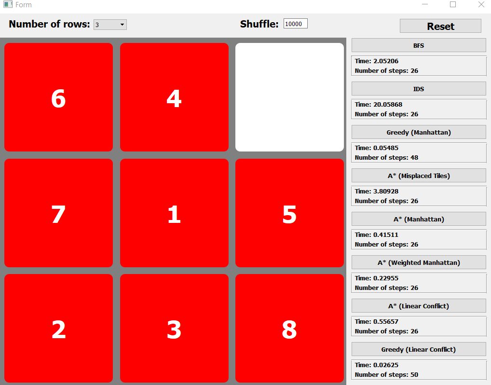

# AI_HUST_N-PUZZLE

## Introduction
This repo contains our project in *Introduction to Artificial Intelligence* subject at Hanoi University of Science and Technology  
N-PUZZLE problem using Uninformed Search and Informed Search to to solve the problem and check the efficiency through experiments.

## Contribute
+ Tạ Hữu Bình - 20190094 - CTTN KHMT K64
+ Trần Trọng Hiệp - 20190051 - CTTN KHMT K64

## Table of contents
1. [Introduction](#Introduction)
2. [Contribute](#Contribute)
3. [Requirement](#Dependencies)
4. [Installation](#INSTALLATION)
5. [Quick use](#QUICK-USE)
## Requirement
**Programming language**: Python version 3.8 or greater  
**Library**: PyQt5  
## Installation
Import PyQT5 library:
```
pip install PyQt5
```

## Quick use
Run N-PUZZLE app:
```
cd N_puzzle
python app.py
```

or

Run **app.py** file in **N_puzzle** folder to start the program.

  


Click on the name of any algorithm to run.
Choose the `number of rows`, fill in the `Shuffle` box and then click to the `Reset` button to shuffle the board from its goal state.

The main components of the program are shown in the image above:

+ **Number of rows**: Decide the number of rows on the board.

+ **Shuffle**: Decide the number of shuffle times from the goal state.

+ **Reset**: Make a new game.

Key event: 
+ To move the empty tile, press **A** to move left, **D** to move right, **W** to move up, or **S** to move down.  
+ Press **B** to simulate the path from origin state to goal one.  
+ Press **U** to go back to the origin state.  

To better understand what is written in this, you can see the article [Application of Artificial Intelligence find the minimum number of steps to win the game N-puzzle] {https://drive.google.com/file/d/1PM2KaY5YixzqP2BLZrAzY4PojcDkoPDf/view?usp=sharing}

